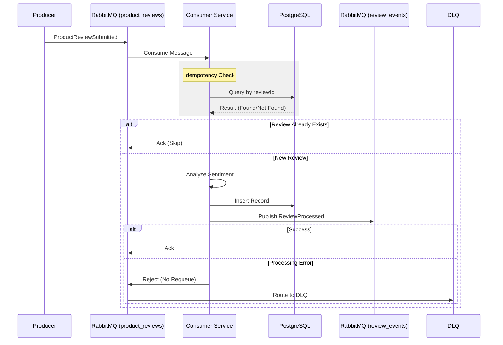

# System Architecture

## Overview
The **Product Review Event Processor** is an event-driven microservice designed to handle high-throughput product reviews. It ensures reliability through idempotency and dead-letter queues, and provides enrichment via sentiment analysis.

## System Components

### 1. Messaging Infrastructure (RabbitMQ)
- **Main Exchange/Queue**: `product_reviews`
  - Receives `ProductReviewSubmitted` events.
- **Dead Letter Exchange (DLX)**: `product_reviews_dlx`
  - Handles rejected/failed messages.
- **Events Exchange**: `review_events`
  - Publishes `ReviewProcessed` events.

### 2. Processor Service (Python)
- **Consumer**: Listens to `product_reviews`.
- **Idempotency Layer**: Checks `processed_reviews` table for existing `reviewId`.
- **Sentiment Engine**: Uses `TextBlob` to classify comments.
- **Publisher**: Emits events to `review_events`.

### 3. Data Storage (PostgreSQL)
- **Table**: `processed_reviews`
  - Stores the original data + sentiment score + timestamp.

## Data Flow

## Directory Structure
- `src/`: Source code.
  - `consumer.py`: Main entry point and orchestration logic.
  - `publisher.py`: Event publishing logic.
  - `sentiment.py`: Sentiment analysis logic.
  - `database.py`: Database models and connection logic.
- `tests/`: Unit and integration tests.

## Design Decisions
- **Idempotency**: We use the `review_id` as a primary key constraint and checked before processing to prevent duplicate operations.
- **Fault Tolerance**: Messages that fail parsing or processing are sent to a DLQ to ensure no data loss and allow manual inspection.
- **Containerization**: Docker Compose manages the lifecycle of the app and its dependencies (RabbitMQ, Postgres) for consistent environments.
